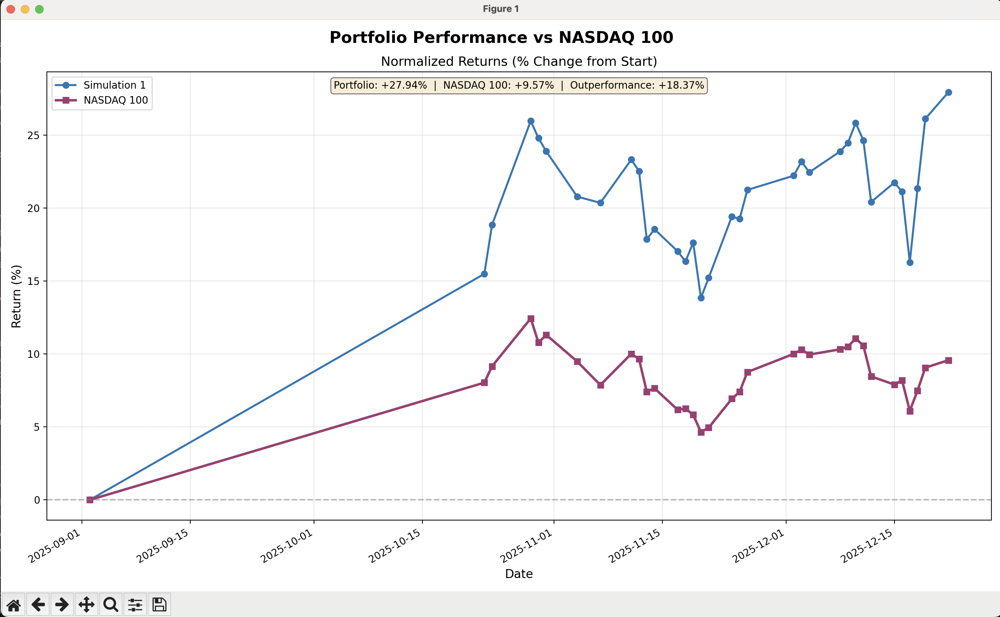
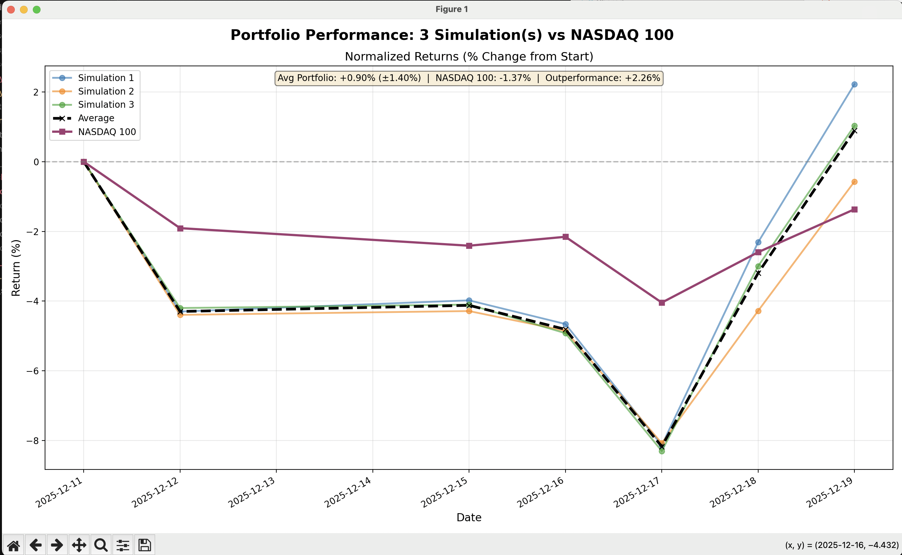

# Stock Trading Agent

LangGraph stock trading agent with the goal to outperform Nasdaq100

## Performance vs Nasdaq 100



## Simulations



## Setup

1. Install dependencies: `uv sync`
2. Set environment variables in `.env`:
   - `OPENAI_API_KEY`
   - `TAVILY_API_KEY`
   - `LANGSMITH_API_KEY`

## Running the Agent

Run the automation script:
```bash
python automation.py
```

The automation script performs the following steps:
- Downloads the latest stock data
- Updates the portfolio with current prices
- Runs the trading agent
- Sends an email with the agent analysis and trade recommendations

## Output
The agent provides detailed market analysis and specific buy/sell recommendations with reasoning based on technical indicators, fundamental metrics, and current market conditions.
